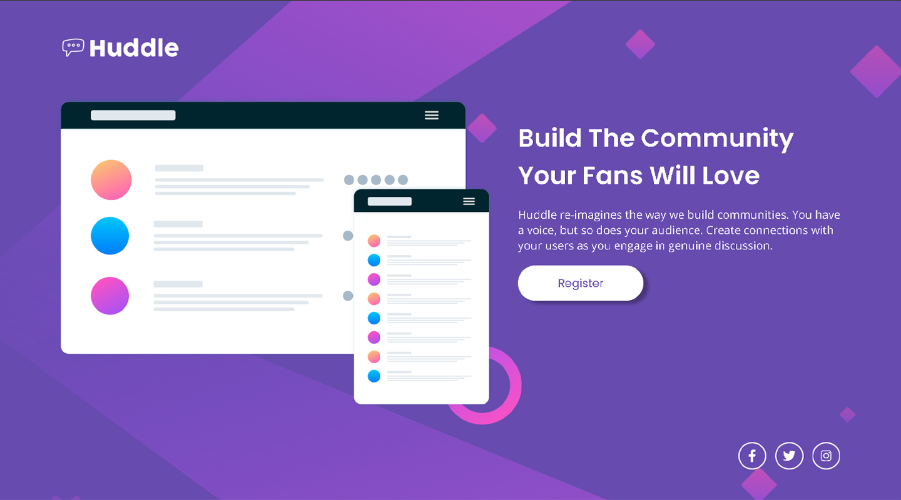
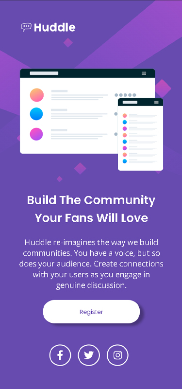
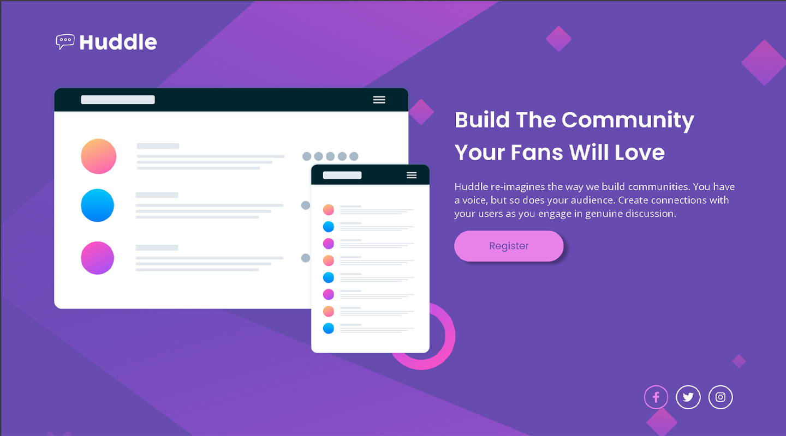

# Frontend Mentor - Huddle landing page

Esta é uma solução para o desafio do [Frontend Mentor -  Huddle landing page](https://www.frontendmentor.io/challenges/huddle-landing-page-with-a-single-introductory-section-B_2Wvxgi0). Indicado no DevQuest do [Dev em Dobro](https://www.youtube.com/@DevemDobro).

## Sumário

- [Visão Geral](#visão-geral)
    - [O desafio](#o-desafio)
    - [Captura de telas](#captura-de-tela)
    - [Construido com](#construido-com)
    - [Recursos](#recursos)

## Visão Geral

### O desafio:
Os usuários devem ser capazes de:
- Visualizar o layout ideal da página para Desktop e Mobile.
- Ver todos os elementos interativos na página.

## Captura de tela

### Versão Desktop:

    

### Versão Mobile:

    

### Elementos Interativos:

    

### Construido com:

 

- Marcação HTML5
- Propriedades personalizadas com CSS
- Flexbox

### Recursos:

- [Google Fonts](https://fonts.google.com/) - Utilizado para colocar as fontes do projeto.

- [Font Awesome](https://fontawesome.com/) - Utilizado para colocar os icones das redes sociais.
